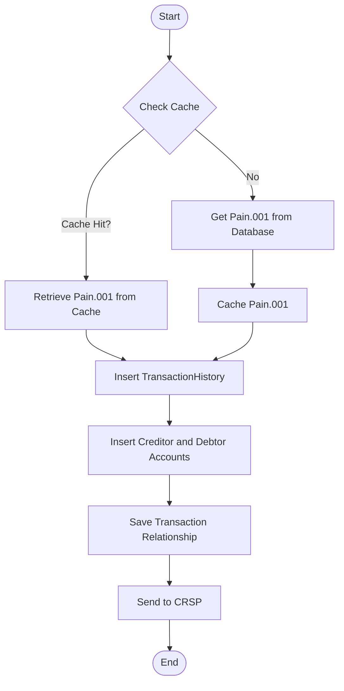

# 1. Transaction Monitoring Service (TMS)

See also, [Tazama Transaction Monitoring Service overview](https://frmscoe.atlassian.net/wiki/spaces/ACTIO/pages/1737938/Actio+Transaction+Monitoring+Service+overview)

- [1. Transaction Monitoring Service (TMS)](#1-transaction-monitoring-service-tms)
  - [Sequence Diagram ISO Messages](#sequence-diagram-iso-messages)
  - [Activity Diagram](#activity-diagram)
    - [Cache Interactions](#cache-interactions)
      - [Pain013](#pain013)
  - [Repository](#repository)
  - [Pain001 Message](#pain001-message)
  - [Pain013 Message](#pain013-message)
  - [Pacs002 Message](#pacs002-message)
  - [Pacs008 Message](#pacs008-message)

## Sequence Diagram ISO Messages

[https://github.com/frmscoe/uml-diagrams/blob/main/services/Transaction-Monitoring-Service-Sequence.puml](https://github.com/frmscoe/uml-diagrams/blob/main/services/Transaction-Monitoring-Service-Sequence.puml)


Transaction monitoring is one of many risk management activities that an organization must perform to ensure healthy operations and also to remain compliant with relevant legislation or regulations.

Currently, it accepts ISO20022 Pain001.001.11 message , pain.013 message , pacs.002.001.12 and pacs.008.001.10. For more information click here[https://github.com/frmscoe/docs/blob/main/Product/transaction-monitoring-service-api.md](https://github.com/frmscoe/docs/blob/dev/Knowledge-Articles/iso20022-and-tazama.md)

## Activity Diagram

The activity diagram below applies to Pain001, Pain013, Pacs008 and Pacs002 messages.

[https://github.com/frmscoe/uml-diagrams/blob/main/services/Transaction-Monitoring-Service.plantuml](https://github.com/frmscoe/uml-diagrams/blob/main/services/Transaction-Monitoring-Service.plantuml)


## High Level Cache Interactions

### Pain001


### Pain013


### Pain008


### Pacs002


### Cache Interactions

#### Pain013




## Repository

[GitHub - frmscoe/tms-service](https://github.com/frmscoe/tms-service)

## Pain001 Message

**Sample Request Body (ISO20022 Pain001)**

<details>
  <summary>
    Pain.001.001.11 Message
  </summary>
  
  ```json
  {
  "TxTp": "pain.001.001.11",
  "CstmrCdtTrfInitn": {
    "GrpHdr": {
      "MsgId": "24988b914e3d4cf98a7659b2c45ce063258",
      "CreDtTm": "2021-12-03T12:40:14.000Z",
      "NbOfTxs": 1,
      "InitgPty": {
        "Nm": "April Blake Grant",
        "Id": {
          "PrvtId": {
            "DtAndPlcOfBirth": {
              "BirthDt": "1968-02-01",
              "CityOfBirth": "Unknown",
              "CtryOfBirth": "ZZ"
            },
            "Othr": {
              "Id": "+27730975224",
              "SchmeNm": {
                "Prtry": "MSISDN"
              }
            }
          }
        },
        "CtctDtls": {
          "MobNb": "+27-730975224"
        }
      }
    },
    "PmtInf": {
      "PmtInfId": "5ab4fc7355de4ef8a75b78b00a681ed2569",
      "PmtMtd": "TRA",
      "ReqdAdvcTp": {
        "DbtAdvc": {
          "Cd": "ADWD",
          "Prtry": "Advice with transaction details"
        }
      },
      "ReqdExctnDt": {
        "Dt": "2021-12-03",
        "DtTm": "2021-12-03T12:40:14.000Z"
      },
      "Dbtr": {
        "Nm": "April Blake Grant",
        "Id": {
          "PrvtId": {
            "DtAndPlcOfBirth": {
              "BirthDt": "1968-02-01",
              "CityOfBirth": "Unknown",
              "CtryOfBirth": "ZZ"
            },
            "Othr": {
              "Id": "+27730975224",
              "SchmeNm": {
                "Prtry": "MSISDN"
              }
            }
          }
        },
        "CtctDtls": {
          "MobNb": "+27-730975224"
        }
      },
      "DbtrAcct": {
        "Id": {
          "Othr": {
            "Id": "+27730975224",
            "SchmeNm": {
              "Prtry": "MSISDN"
            }
          }
        },
        "Nm": "April Grant"
      },
      "DbtrAgt": {
        "FinInstnId": {
          "ClrSysMmbId": {
            "MmbId": "dfsp001"
          }
        }
      },
      "CdtTrfTxInf": {
        "PmtId": {
          "EndToEndId": "2c516801007642dfb892944dde1cf845"
        },
        "PmtTpInf": {
          "CtgyPurp": {
            "Prtry": "TRANSFER BLANK"
          }
        },
        "Amt": {
          "InstdAmt": {
            "Amt": {
              "Amt": 31020.89,
              "Ccy": "USD"
            }
          },
          "EqvtAmt": {
            "Amt": {
              "Amt": 31020.89,
              "Ccy": "USD"
            },
            "CcyOfTrf": "USD"
          }
        },
        "ChrgBr": "DEBT",
        "CdtrAgt": {
          "FinInstnId": {
            "ClrSysMmbId": {
              "MmbId": "dfsp002"
            }
          }
        },
        "Cdtr": {
          "Nm": "Felicia Easton Quill",
          "Id": {
            "PrvtId": {
              "DtAndPlcOfBirth": {
                "BirthDt": "1935-05-08",
                "CityOfBirth": "Unknown",
                "CtryOfBirth": "ZZ"
              },
              "Othr": {
                "Id": "+27707650428",
                "SchmeNm": {
                  "Prtry": "MSISDN"
                }
              }
            }
          },
          "CtctDtls": {
            "MobNb": "+27-707650428"
          }
        },
        "CdtrAcct": {
          "Id": {
            "Othr": {
              "Id": "+27707650428",
              "SchmeNm": {
                "Prtry": "MSISDN"
              }
            }
          },
          "Nm": "Felicia Quill"
        },
        "Purp": {
          "Cd": "MP2P"
        },
        "RgltryRptg": {
          "Dtls": {
            "Tp": "BALANCE OF PAYMENTS",
            "Cd": "100"
          }
        },
        "RmtInf": {
          "Ustrd": "Payment of USD 30713.75 from April to Felicia"
        },
        "SplmtryData": {
          "Envlp": {
            "Doc": {
              "Dbtr": {
                "FrstNm": "April",
                "MddlNm": "Blake",
                "LastNm": "Grant",
                "MrchntClssfctnCd": "BLANK"
              },
              "Cdtr": {
                "FrstNm": "Felicia",
                "MddlNm": "Easton",
                "LastNm": "Quill",
                "MrchntClssfctnCd": "BLANK"
              },
              "DbtrFinSvcsPrvdrFees": {
                "Ccy": "USD",
                "Amt": 307.14
              },
              "Xprtn": "2021-11-30T10:38:56.000Z"
            }
          }
        }
      }
    },
    "SplmtryData": {
      "Envlp": {
        "Doc": {
          "InitgPty": {
            "InitrTp": "CONSUMER",
            "Glctn": {
              "Lat": "-3.1609",
              "Long": "38.3588"
            }
          }
        }
      }
    }
  }
}

```
</details>


## Pain013 Message

**Sample Request Body (ISO20022 Pain013)**

<details>
  <summary>
    Pain.013.001.09 Message
  </summary>

```json
{
  "TxTp": "pain.013.001.09",
  "CdtrPmtActvtnReq": {
    "GrpHdr": {
      "MsgId": "42665509efd844da90caf468e891aa52256",
      "CreDtTm": "2021-12-03T12:40:16.000Z",
      "NbOfTxs": 1,
      "InitgPty": {
        "Nm": "April Blake Grant",
        "Id": {
          "PrvtId": {
            "DtAndPlcOfBirth": {
              "BirthDt": "1968-02-01",
              "CityOfBirth": "Unknown",
              "CtryOfBirth": "ZZ"
            },
            "Othr": {
              "Id": "+27730975224",
              "SchmeNm": {
                "Prtry": "MSISDN"
              }
            }
          }
        },
        "CtctDtls": {
          "MobNb": "+27-730975224"
        }
      }
    },
    "PmtInf": {
      "PmtInfId": "5ab4fc7355de4ef8a75b78b00a681ed2254",
      "PmtMtd": "TRA",
      "ReqdAdvcTp": {
        "DbtAdvc": {
          "Cd": "ADWD",
          "Prtry": "Advice with transaction details"
        }
      },
      "ReqdExctnDt": {
        "DtTm": "2021-12-03T12:40:14.000Z"
      },
      "XpryDt": {
        "DtTm": "2021-11-30T10:38:56.000Z"
      },
      "Dbtr": {
        "Nm": "April Blake Grant",
        "Id": {
          "PrvtId": {
            "DtAndPlcOfBirth": {
              "BirthDt": "1968-02-01",
              "CityOfBirth": "Unknown",
              "CtryOfBirth": "ZZ"
            },
            "Othr": {
              "Id": "+27730975224",
              "SchmeNm": {
                "Prtry": "MSISDN"
              }
            }
          }
        },
        "CtctDtls": {
          "MobNb": "+27-730975224"
        }
      },
      "DbtrAcct": {
        "Id": {
          "Othr": {
            "Id": "+27730975224",
            "SchmeNm": {
              "Prtry": "MSISDN"
            }
          }
        },
        "Nm": "April Grant"
      },
      "DbtrAgt": {
        "FinInstnId": {
          "ClrSysMmbId": {
            "MmbId": "dfsp001"
          }
        }
      },
      "CdtTrfTxInf": {
        "PmtId": {
          "EndToEndId": "2c516801007642dfb892944dde1cf845"
        },
        "PmtTpInf": {
          "CtgyPurp": {
            "Prtry": "TRANSFER BLANK"
          }
        },
        "Amt": {
          "InstdAmt": {
            "Amt": {
              "Amt": 31020.89,
              "Ccy": "USD"
            }
          },
          "EqvtAmt": {
            "Amt": {
              "Amt": 31020.89,
              "Ccy": "USD"
            },
            "CcyOfTrf": "USD"
          }
        },
        "ChrgBr": "DEBT",
        "CdtrAgt": {
          "FinInstnId": {
            "ClrSysMmbId": {
              "MmbId": "dfsp002"
            }
          }
        },
        "Cdtr": {
          "Nm": "Felicia Easton Quill",
          "Id": {
            "PrvtId": {
              "DtAndPlcOfBirth": {
                "BirthDt": "1935-05-08",
                "CityOfBirth": "Unknown",
                "CtryOfBirth": "ZZ"
              },
              "Othr": {
                "Id": "+27707650428",
                "SchmeNm": {
                  "Prtry": "MSISDN"
                }
              }
            }
          },
          "CtctDtls": {
            "MobNb": "+27-707650428"
          }
        },
        "CdtrAcct": {
          "Id": {
            "Othr": {
              "Id": "+27707650428",
              "SchmeNm": {
                "Prtry": "MSISDN"
              }
            }
          },
          "Nm": "Felicia Quill"
        },
        "Purp": {
          "Cd": "MP2P"
        },
        "RgltryRptg": {
          "Dtls": {
            "Tp": "BALANCE OF PAYMENTS",
            "Cd": "100"
          }
        },
        "SplmtryData": {
          "Envlp": {
            "Doc": {
              "PyeeRcvAmt": {
                "Amt": {
                  "Amt": 30713.75,
                  "Ccy": "USD"
                }
              },
              "PyeeFinSvcsPrvdrFee": {
                "Amt": {
                  "Amt": 153.57,
                  "Ccy": "USD"
                }
              },
              "PyeeFinSvcsPrvdrComssn": {
                "Amt": {
                  "Amt": 30.71,
                  "Ccy": "USD"
                }
              }
            }
          }
        }
      }
    },
    "SplmtryData": {
      "Envlp": {
        "Doc": {
          "InitgPty": {
            "Glctn": {
              "Lat": "-3.1609",
              "Long": "38.3588"
            }
          }
        }
      }
    }
  }
}
```

</details>

## Pacs008 Message

**Sample Request Body (ISO20022 Pacs008)**

<details>
  <summary>
    pacs.008.001.10 Message
  </summary>

```json
{
  "TxTp": "pacs.008.001.10",
  "FIToFICstmrCdt": {
    "GrpHdr": {
      "MsgId": "8cc4f6ffb4fd4e31b42aec0ed5d600a0123",
      "CreDtTm": "2021-12-03T15:24:25.000Z",
      "NbOfTxs": 1,
      "SttlmInf": {
        "SttlmMtd": "CLRG"
      }
    },
    "CdtTrfTxInf": {
      "PmtId": {
        "InstrId": "5ab4fc7355de4ef8a75b78b00a681ed2879",
        "EndToEndId": "2c516801007642dfb892944dde1cf845789"
      },
      "IntrBkSttlmAmt": {
        "Amt": {
          "Amt": 31020.89,
          "Ccy": "USD"
        }
      },
      "InstdAmt": {
        "Amt": {
          "Amt": 31020.89,
          "Ccy": "USD"
        }
      },
      "ChrgBr": "DEBT",
      "ChrgsInf": {
        "Amt": {
          "Amt": 307.14,
          "Ccy": "USD"
        },
        "Agt": {
          "FinInstnId": {
            "ClrSysMmbId": {
              "MmbId": "dfsp001"
            }
          }
        }
      },
      "InitgPty": {
        "Nm": "April Blake Grant",
        "Id": {
          "PrvtId": {
            "DtAndPlcOfBirth": {
              "BirthDt": "1968-02-01",
              "CityOfBirth": "Unknown",
              "CtryOfBirth": "ZZ"
            },
            "Othr": {
              "Id": "+27730975224",
              "SchmeNm": {
                "Prtry": "MSISDN"
              }
            }
          }
        },
        "CtctDtls": {
          "MobNb": "+27-730975224"
        }
      },
      "Dbtr": {
        "Nm": "April Blake Grant",
        "Id": {
          "PrvtId": {
            "DtAndPlcOfBirth": {
              "BirthDt": "1968-02-01",
              "CityOfBirth": "Unknown",
              "CtryOfBirth": "ZZ"
            },
            "Othr": {
              "Id": "+27730975224",
              "SchmeNm": {
                "Prtry": "MSISDN"
              }
            }
          }
        },
        "CtctDtls": {
          "MobNb": "+27-730975224"
        }
      },
      "DbtrAcct": {
        "Id": {
          "Othr": {
            "Id": "+27730975224",
            "SchmeNm": {
              "Prtry": "MSISDN"
            }
          }
        },
        "Nm": "April Grant"
      },
      "DbtrAgt": {
        "FinInstnId": {
          "ClrSysMmbId": {
            "MmbId": "dfsp001"
          }
        }
      },
      "CdtrAgt": {
        "FinInstnId": {
          "ClrSysMmbId": {
            "MmbId": "dfsp002"
          }
        }
      },
      "Cdtr": {
        "Nm": "Felicia Easton Quill",
        "Id": {
          "PrvtId": {
            "DtAndPlcOfBirth": {
              "BirthDt": "1935-05-08",
              "CityOfBirth": "Unknown",
              "CtryOfBirth": "ZZ"
            },
            "Othr": {
              "Id": "+27707650428",
              "SchmeNm": {
                "Prtry": "MSISDN"
              }
            }
          }
        },
        "CtctDtls": {
          "MobNb": "+27-707650428"
        }
      },
      "CdtrAcct": {
        "Id": {
          "Othr": {
            "Id": "+27707650428",
            "SchmeNm": {
              "Prtry": "MSISDN"
            }
          }
        },
        "Nm": "Felicia Quill"
      },
      "Purp": {
        "Cd": "MP2P"
      }
    },
    "RgltryRptg": {
      "Dtls": {
        "Tp": "BALANCE OF PAYMENTS",
        "Cd": "100"
      }
    },
    "RmtInf": {
      "Ustrd": "Payment of USD 30713.75 from April to Felicia"
    },
    "SplmtryData": {
      "Envlp": {
        "Doc": {
          "Xprtn": "2021-11-30T10:38:56.000Z"
        }
      }
    }
  }
}
```

</details>

**Expected Response for pacs008**

<details>
  <summary>
    pacs.008.001.10 Response
  </summary>

  ```json
{
  "TxTp": "pacs.008.001.10",
  "FIToFICstmrCdt": {
    "GrpHdr": {
      "MsgId": "8cc4f6ffb4fd4e31b42aec0ed5d600a0123",
      "CreDtTm": "2021-12-03T15:24:25.000Z",
      "NbOfTxs": 1,
      "SttlmInf": {
        "SttlmMtd": "CLRG"
      }
    },
    "CdtTrfTxInf": {
      "PmtId": {
        "InstrId": "5ab4fc7355de4ef8a75b78b00a681ed2879",
        "EndToEndId": "2c516801007642dfb892944dde1cf845789"
      },
      "IntrBkSttlmAmt": {
        "Amt": {
          "Amt": 31020.89,
          "Ccy": "USD"
        }
      },
      "InstdAmt": {
        "Amt": {
          "Amt": 31020.89,
          "Ccy": "USD"
        }
      },
      "ChrgBr": "DEBT",
      "ChrgsInf": {
        "Amt": {
          "Amt": 307.14,
          "Ccy": "USD"
        },
        "Agt": {
          "FinInstnId": {
            "ClrSysMmbId": {
              "MmbId": "dfsp001"
            }
          }
        }
      },
      "InitgPty": {
        "Nm": "April Blake Grant",
        "Id": {
          "PrvtId": {
            "DtAndPlcOfBirth": {
              "BirthDt": "1968-02-01",
              "CityOfBirth": "Unknown",
              "CtryOfBirth": "ZZ"
            },
            "Othr": {
              "Id": "+27730975224",
              "SchmeNm": {
                "Prtry": "MSISDN"
              }
            }
          }
        },
        "CtctDtls": {
          "MobNb": "+27-730975224"
        }
      },
      "Dbtr": {
        "Nm": "April Blake Grant",
        "Id": {
          "PrvtId": {
            "DtAndPlcOfBirth": {
              "BirthDt": "1968-02-01",
              "CityOfBirth": "Unknown",
              "CtryOfBirth": "ZZ"
            },
            "Othr": {
              "Id": "+27730975224",
              "SchmeNm": {
                "Prtry": "MSISDN"
              }
            }
          }
        },
        "CtctDtls": {
          "MobNb": "+27-730975224"
        }
      },
      "DbtrAcct": {
        "Id": {
          "Othr": {
            "Id": "+27730975224",
            "SchmeNm": {
              "Prtry": "MSISDN"
            }
          }
        },
        "Nm": "April Grant"
      },
      "DbtrAgt": {
        "FinInstnId": {
          "ClrSysMmbId": {
            "MmbId": "dfsp001"
          }
        }
      },
      "CdtrAgt": {
        "FinInstnId": {
          "ClrSysMmbId": {
            "MmbId": "dfsp002"
          }
        }
      },
      "Cdtr": {
        "Nm": "Felicia Easton Quill",
        "Id": {
          "PrvtId": {
            "DtAndPlcOfBirth": {
              "BirthDt": "1935-05-08",
              "CityOfBirth": "Unknown",
              "CtryOfBirth": "ZZ"
            },
            "Othr": {
              "Id": "+27707650428",
              "SchmeNm": {
                "Prtry": "MSISDN"
              }
            }
          }
        },
        "CtctDtls": {
          "MobNb": "+27-707650428"
        }
      },
      "CdtrAcct": {
        "Id": {
          "Othr": {
            "Id": "+27707650428",
            "SchmeNm": {
              "Prtry": "MSISDN"
            }
          }
        },
        "Nm": "Felicia Quill"
      },
      "Purp": {
        "Cd": "MP2P"
      }
    },
    "RgltryRptg": {
      "Dtls": {
        "Tp": "BALANCE OF PAYMENTS",
        "Cd": "100"
      }
    },
    "RmtInf": {
      "Ustrd": "Payment of USD 30713.75 from April to Felicia"
    },
    "SplmtryData": {
      "Envlp": {
        "Doc": {
          "Xprtn": "2021-11-30T10:38:56.000Z"
        }
      }
    }
  }
}
```

</details>


## Pacs002 Message

**Sample Request Body (ISO20022 Pacs002)**

<details>
  <summary>
    pacs.002.001.12 Message
  </summary>
  
  ```json
{
  "TxTp": "pacs.002.001.12",
  "FIToFIPmtSts": {
    "GrpHdr": {
      "MsgId": "30bea71c5a054978ad0da7f94b2a40e9789",
      "CreDtTm": "2021-12-03T15:24:27.000Z"
    },
    "TxInfAndSts": {
      "OrgnlInstrId": "5ab4fc7355de4ef8a75b78b00a681ed2255",
      "OrgnlEndToEndId": "2c516801007642dfb892944dde1cf845897",
      "TxSts": "ACCC",
      "ChrgsInf": [
        {
          "Amt": {
            "Amt": 307.14,
            "Ccy": "USD"
          },
          "Agt": {
            "FinInstnId": {
              "ClrSysMmbId": {
                "MmbId": "dfsp001"
              }
            }
          }
        },
        {
          "Amt": {
            "Amt": 153.57,
            "Ccy": "USD"
          },
          "Agt": {
            "FinInstnId": {
              "ClrSysMmbId": {
                "MmbId": "dfsp001"
              }
            }
          }
        },
        {
          "Amt": {
            "Amt": 30.71,
            "Ccy": "USD"
          },
          "Agt": {
            "FinInstnId": {
              "ClrSysMmbId": {
                "MmbId": "dfsp002"
              }
            }
          }
        }
      ],
      "AccptncDtTm": "2021-12-03T15:24:26.000Z",
      "InstgAgt": {
        "FinInstnId": {
          "ClrSysMmbId": {
            "MmbId": "dfsp001"
          }
        }
      },
      "InstdAgt": {
        "FinInstnId": {
          "ClrSysMmbId": {
            "MmbId": "dfsp002"
          }
        }
      }
    }
  }
}
```
  </details>
