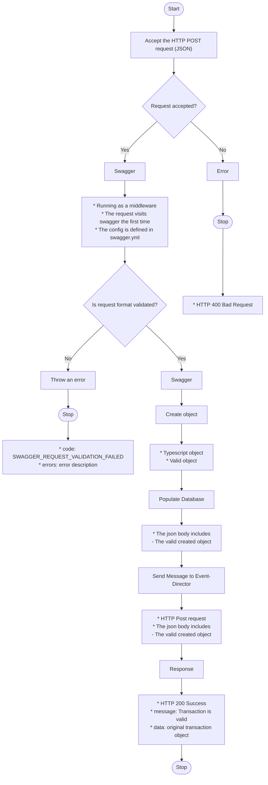

<!-- SPDX-License-Identifier: Apache-2.0 -->

# 1. Transaction Monitoring Service (TMS)

See also, [Tazama Transaction Monitoring Service overview](https://github.com/tazama-lf/docs/blob/dev/Product/transaction-monitoring-service-api.md)

- [1. Transaction Monitoring Service (TMS)](#1-transaction-monitoring-service-tms)
  - [Sequence Diagram ISO Messages](#sequence-diagram-iso-messages)
  - [Activity Diagram](#activity-diagram)
  - [Repository](#repository)
  - [Pain001 Message](#pain001-message)
  - [Pain013 Message](#pain013-message)
  - [Pacs008 Message](#pacs008-message)
  - [Pacs002 Message](#pacs002-message)

## Sequence Diagram ISO Messages

```mermaid
sequenceDiagram
    participant Client as "External Client"
    participant TMS as "Transaction Monitoring Service"
    participant log as "Logger"
    participant DB as "Postgres"
    participant Cache as "Valkey Cache"
    participant ED as "Event-Director"

    %% ISO20022 Message Pain001
        Client ->>+ TMS: POST /v1/evaluate/iso20022/pain.001.001.11: Pain001.001.11 Message
        TMS ->> TMS: Validate Pain001
        TMS ->> log: Logging of receipt
        alt Validation Error
        TMS ->> log: Logging of error
        TMS ->> Client: /v1/evaluate/iso20022/pain.001.001.11 POST Result
        end
                par save in Postgres
                    TMS ->> DB: saveTransactionHistory(pain001)
                    TMS ->> DB: addAccount(debtor)
                    TMS ->> DB: addAccount(creditor)
                    TMS ->> DB: addEntity(debtor)
                    TMS ->> DB: addEntity(creditor)                   
                end
                par save in Postgres
                    TMS ->> DB: saveTransactionRelationship(pain001)
                    TMS ->> DB: addAccountHolder(debtor)
                    TMS ->> DB: addAccountHolder(creditor)                
                end
            
        alt Error
        TMS ->> log: Logging of error
        TMS ->> TMS: Throw error
        end
        TMS ->> ED: NATS handleResponse: Pain001 Message
        TMS ->> log: Transaction sent to ED service
        TMS ->> Client: /v1/evaluate/iso20022/pain.001.001.11 POST Result
    
    %% ISO20022 Message Pain013
        Client ->>+ TMS: POST /v1/evaluate/iso20022/pain.013.001.09: Pain013.001.09 Message
        TMS ->> TMS: Validate Pain013
        TMS ->> log: Logging of receipt
        alt Validation Error
        TMS ->> log: Logging of error
        TMS ->> Client: /v1/evaluate/iso20022/pain.013.001.09 POST Result
        end
            par save in Postgres
                TMS ->> DB: saveTransactionHistory(pain013)
                TMS ->> DB: addAccount(debtor)
                TMS ->> DB: addAccount(creditor)
            end
            TMS ->> DB: saveTransactionRelationship(pain013)
        alt Error
        TMS ->> log: Logging of error
        TMS ->> TMS: Throw error
        end
        TMS ->> ED: NATS handleResponse: Pain013 Message
        TMS ->> log: Transaction sent to ED service
        TMS ->> Client: /v1/evaluate/iso20022/pain.013.001.09 POST Result

    %% ISO20022 Message Pacs008
        Client ->>+ TMS: POST /v1/evaluate/iso20022/pacs.008.001.10: Pacs008.001.10 Message
        TMS ->> TMS: Validate Pacs008
        TMS ->> log: Logging of receipt
        alt Validation Error
        TMS ->> log: Logging of error
        TMS ->> Client: /v1/evaluate/iso20022/pacs.008.001.10 POST Result
        end
            par save in Postgres
                TMS ->> DB: addAccount(debtor)
                TMS ->> DB: addAccount(creditor)
                TMS ->> Cache: save Data Cache
                %% TMS ->> DB: saveTransactionHistory(pacs008)
            end
            alt Quoting Enabled
                par save in Postgres
                  TMS ->> DB: addEntity(creditor)
                  TMS ->> DB: addEntity(debtor)
                end

                par save in Postgres
                  TMS ->> DB: addAccountHolder(creditor)
                  TMS ->> DB: addAccountHolder(debtor)
                end
            end
            TMS ->> DB: saveTransactionRelationship
            TMS ->> DB: saveTransactionHistory(pacs008)

            
        alt Error
        TMS ->> log: Logging of error
        TMS ->> TMS: Throw error
        end
        TMS ->> ED: NATS handleResponse: Pacs008 Message
        TMS ->> log: Transaction sent to ED service
        TMS ->> Client: /v1/evaluate/iso20022/pacs.008.001.10 POST Result

    %% ISO20022 Message Pacs002
        Client ->>+ TMS: POST /v1/evaluate/iso20022/pacs.002.001.12: Pacs002.001.12 Message
        TMS ->> TMS: Validate Pacs002
        TMS ->> log: Logging of receipt
        alt Validation Error
        TMS ->> log: Logging of error
        TMS ->> Client: /v1/evaluate/iso20022/pacs.002.001.12 POST Result
        end
        TMS ->> Cache: getCache
        alt cache miss
          TMS ->> DB: get Pacs008
          TMS ->> TMS: rebuild cache
        end
        TMS ->> DB: saveTransactionHistory
        TMS ->> DB: get Pacs008
        TMS ->> DB: saveTransactionRelationship
        alt Error
        TMS ->> log: Logging of error
        TMS ->> TMS: Throw error
        end
        TMS ->> ED: NATS handleResponse: Pacs002 Message
        TMS ->> log: Transaction sent to ED service
        TMS ->> Client: /v1/evaluate/iso20022/pacs.002.001.12 POST Result
```




Transaction monitoring is one of many risk management activities that an organization must perform to ensure healthy operations and also to remain compliant with relevant legislation or regulations.

Currently, the TMS API is able to accept ISO20022 pain.001.001.11, pain.013.001.09, pacs.002.001.12 and pacs.008.001.10 messages. Depending on the configuration of the TMS API service via the `QUOTING` environment variable, the pain.001 and pain.013 messages may be excluded (`QUOTING=false`).

API authentication is turned off by default (ENV: `AUTHENTICATED=false`) but when turned on a public key (ENV `CERT_PATH_PUBLIC=/path/to/public/key`) is required to be able to validate tokens received via the Auth-Service login.

## Activity Diagram

The activity diagram below applies to Pain001, Pain013, Pacs008 and Pacs002 messages.




## Repository

[GitHub - tazama-lf/tms-service](https://github.com/tazama-lf/tms-service)

## Pain001 Message

**Sample Request Body (ISO20022 Pain001)**

<details>
  <summary>
    Pain.001.001.11 Message
  </summary>
  
  ```json
  {
  "CstmrCdtTrfInitn": {
    "GrpHdr": {
      "MsgId": "24988b914e3d4cf98a7659b2c45ce063258",
      "CreDtTm": "2021-12-03T12:40:14.000Z",
      "NbOfTxs": 1,
      "InitgPty": {
        "Nm": "April Blake Grant",
        "Id": {
          "PrvtId": {
            "DtAndPlcOfBirth": {
              "BirthDt": "1968-02-01",
              "CityOfBirth": "Unknown",
              "CtryOfBirth": "ZZ"
            },
            "Othr": [
              {
                "Id": "+27730975224",
                "SchmeNm": {
                  "Prtry": "MSISDN"
                }
              }
            ]
          }
        },
        "CtctDtls": {
          "MobNb": "+27-730975224"
        }
      }
    },
    "PmtInf": {
      "PmtInfId": "5ab4fc7355de4ef8a75b78b00a681ed2569",
      "PmtMtd": "TRA",
      "ReqdAdvcTp": {
        "DbtAdvc": {
          "Cd": "ADWD",
          "Prtry": "Advice with transaction details"
        }
      },
      "ReqdExctnDt": {
        "Dt": "2021-12-03",
        "DtTm": "2021-12-03T12:40:14.000Z"
      },
      "Dbtr": {
        "Nm": "April Blake Grant",
        "Id": {
          "PrvtId": {
            "DtAndPlcOfBirth": {
              "BirthDt": "1968-02-01",
              "CityOfBirth": "Unknown",
              "CtryOfBirth": "ZZ"
            },
            "Othr": [
              {
                "Id": "+27730975224",
                "SchmeNm": {
                  "Prtry": "MSISDN"
                }
              }
            ]
          }
        },
        "CtctDtls": {
          "MobNb": "+27-730975224"
        }
      },
      "DbtrAcct": {
        "Id": {
          "Othr": [
            {
              "Id": "+27730975224",
              "SchmeNm": {
                "Prtry": "MSISDN"
              }
            }
          ]
        },
        "Nm": "April Grant"
      },
      "DbtrAgt": {
        "FinInstnId": {
          "ClrSysMmbId": {
            "MmbId": "dfsp001"
          }
        }
      },
      "CdtTrfTxInf": {
        "PmtId": {
          "EndToEndId": "2c516801007642dfb892944dde1cf845"
        },
        "PmtTpInf": {
          "CtgyPurp": {
            "Prtry": "TRANSFER BLANK"
          }
        },
        "Amt": {
          "InstdAmt": {
            "Amt": {
              "Amt": 31020.89,
              "Ccy": "USD"
            }
          },
          "EqvtAmt": {
            "Amt": {
              "Amt": 31020.89,
              "Ccy": "USD"
            },
            "CcyOfTrf": "USD",
            "XchgRate": 1.00,
          }
        },
        "ChrgBr": "DEBT",
        "CdtrAgt": {
          "FinInstnId": {
            "ClrSysMmbId": {
              "MmbId": "dfsp002"
            }
          }
        },
        "Cdtr": {
          "Nm": "Felicia Easton Quill",
          "Id": {
            "PrvtId": {
              "DtAndPlcOfBirth": {
                "BirthDt": "1935-05-08",
                "CityOfBirth": "Unknown",
                "CtryOfBirth": "ZZ"
              },
              "Othr": [
                {
                  "Id": "+27707650428",
                  "SchmeNm": {
                    "Prtry": "MSISDN"
                  }
                }
              ]
            }
          },
          "CtctDtls": {
            "MobNb": "+27-707650428"
          }
        },
        "CdtrAcct": {
          "Id": {
            "Othr": [
              {
                "Id": "+27707650428",
                "SchmeNm": {
                  "Prtry": "MSISDN"
                }
              }
            ]
          },
          "Nm": "Felicia Quill"
        },
        "Purp": {
          "Cd": "MP2P"
        },
        "RgltryRptg": {
          "Dtls": {
            "Tp": "BALANCE OF PAYMENTS",
            "Cd": "100"
          }
        },
        "RmtInf": {
          "Ustrd": "Payment of USD 30713.75 from April to Felicia"
        },
        "SplmtryData": {
          "Envlp": {
            "Doc": {
              "Dbtr": {
                "FrstNm": "April",
                "MddlNm": "Blake",
                "LastNm": "Grant",
                "MrchntClssfctnCd": "BLANK"
              },
              "Cdtr": {
                "FrstNm": "Felicia",
                "MddlNm": "Easton",
                "LastNm": "Quill",
                "MrchntClssfctnCd": "BLANK"
              },
              "DbtrFinSvcsPrvdrFees": {
                "Ccy": "USD",
                "Amt": 307.14
              },
              "Xprtn": "2021-11-30T10:38:56.000Z"
            }
          }
        }
      }
    },
    "SplmtryData": {
      "Envlp": {
        "Doc": {
          "InitgPty": {
            "InitrTp": "CONSUMER",
            "Glctn": {
              "Lat": "-3.1609",
              "Long": "38.3588"
            }
          }
        }
      }
    }
  }
}

```
</details>


## Pain013 Message

**Sample Request Body (ISO20022 Pain013)**

<details>
  <summary>
    Pain.013.001.09 Message
  </summary>

```json
{
  "CdtrPmtActvtnReq": {
    "GrpHdr": {
      "MsgId": "42665509efd844da90caf468e891aa52256",
      "CreDtTm": "2021-12-03T12:40:16.000Z",
      "NbOfTxs": 1,
      "InitgPty": {
        "Nm": "April Blake Grant",
        "Id": {
          "PrvtId": {
            "DtAndPlcOfBirth": {
              "BirthDt": "1968-02-01",
              "CityOfBirth": "Unknown",
              "CtryOfBirth": "ZZ"
            },
            "Othr": [
              {
                "Id": "+27730975224",
                "SchmeNm": {
                  "Prtry": "MSISDN"
                }
              }
            ]
          }
        },
        "CtctDtls": {
          "MobNb": "+27-730975224"
        }
      }
    },
    "PmtInf": {
      "PmtInfId": "5ab4fc7355de4ef8a75b78b00a681ed2254",
      "PmtMtd": "TRA",
      "ReqdAdvcTp": {
        "DbtAdvc": {
          "Cd": "ADWD",
          "Prtry": "Advice with transaction details"
        }
      },
      "ReqdExctnDt": {
        "DtTm": "2021-12-03T12:40:14.000Z"
      },
      "XpryDt": {
        "DtTm": "2021-11-30T10:38:56.000Z"
      },
      "Dbtr": {
        "Nm": "April Blake Grant",
        "Id": {
          "PrvtId": {
            "DtAndPlcOfBirth": {
              "BirthDt": "1968-02-01",
              "CityOfBirth": "Unknown",
              "CtryOfBirth": "ZZ"
            },
            "Othr": [
              {
                "Id": "+27730975224",
                "SchmeNm": {
                  "Prtry": "MSISDN"
                }
              }
            ]
          }
        },
        "CtctDtls": {
          "MobNb": "+27-730975224"
        }
      },
      "DbtrAcct": {
        "Id": {
          "Othr": [
            {
              "Id": "+27730975224",
              "SchmeNm": {
                "Prtry": "MSISDN"
              }
            }
          ]
        },
        "Nm": "April Grant"
      },
      "DbtrAgt": {
        "FinInstnId": {
          "ClrSysMmbId": {
            "MmbId": "dfsp001"
          }
        }
      },
      "CdtTrfTxInf": {
        "PmtId": {
          "EndToEndId": "2c516801007642dfb892944dde1cf845"
        },
        "PmtTpInf": {
          "CtgyPurp": {
            "Prtry": "TRANSFER BLANK"
          }
        },
        "Amt": {
          "InstdAmt": {
            "Amt": {
              "Amt": 31020.89,
              "Ccy": "USD"
            }
          },
          "EqvtAmt": {
            "Amt": {
              "Amt": 31020.89,
              "Ccy": "USD"
            },
            "CcyOfTrf": "USD"
          }
        },
        "ChrgBr": "DEBT",
        "CdtrAgt": {
          "FinInstnId": {
            "ClrSysMmbId": {
              "MmbId": "dfsp002"
            }
          }
        },
        "Cdtr": {
          "Nm": "Felicia Easton Quill",
          "Id": {
            "PrvtId": {
              "DtAndPlcOfBirth": {
                "BirthDt": "1935-05-08",
                "CityOfBirth": "Unknown",
                "CtryOfBirth": "ZZ"
              },
              "Othr": [
                {
                  "Id": "+27707650428",
                  "SchmeNm": {
                    "Prtry": "MSISDN"
                  }
                }
              ]
            }
          },
          "CtctDtls": {
            "MobNb": "+27-707650428"
          }
        },
        "CdtrAcct": {
          "Id": {
            "Othr": [
              {
                "Id": "+27707650428",
                "SchmeNm": {
                  "Prtry": "MSISDN"
                }
              }
            ]
          },
          "Nm": "Felicia Quill"
        },
        "Purp": {
          "Cd": "MP2P"
        },
        "RgltryRptg": {
          "Dtls": {
            "Tp": "BALANCE OF PAYMENTS",
            "Cd": "100"
          }
        },
        "SplmtryData": {
          "Envlp": {
            "Doc": {
              "PyeeRcvAmt": {
                "Amt": {
                  "Amt": 30713.75,
                  "Ccy": "USD"
                }
              },
              "PyeeFinSvcsPrvdrFee": {
                "Amt": {
                  "Amt": 153.57,
                  "Ccy": "USD"
                }
              },
              "PyeeFinSvcsPrvdrComssn": {
                "Amt": {
                  "Amt": 30.71,
                  "Ccy": "USD"
                }
              }
            }
          }
        }
      }
    },
    "SplmtryData": {
      "Envlp": {
        "Doc": {
          "InitgPty": {
            "Glctn": {
              "Lat": "-3.1609",
              "Long": "38.3588"
            }
          }
        }
      }
    }
  }
}
```

</details>

## Pacs008 Message

**Sample Request Body (ISO20022 Pacs008)**

<details>
  <summary>
    pacs.008.001.10 Message
  </summary>

```json
{
  "FIToFICstmrCdtTrf": {
    "GrpHdr": {
      "MsgId": "24e80c9836f6437e8aa46cbb3fbdd5b1",
      "CreDtTm": "2024-05-27T13:57:33.890Z",
      "NbOfTxs": 1,
      "SttlmInf": {
        "SttlmMtd": "CLRG"
      }
    },
    "CdtTrfTxInf": {
      "PmtId": {
        "InstrId": "5ab4fc7355de4ef8a75b78b00a681ed2",
        "EndToEndId": "fe252acd9f1742d0ad9d74000ecc57d8"
      },
      "IntrBkSttlmAmt": {
        "Amt": {
          "Amt": 531.81,
          "Ccy": "XTS"
        }
      },
      "InstdAmt": {
        "Amt": {
          "Amt": 531.81,
          "Ccy": "XTS"
        }
      },
      "XchgRate": 1.00,
      "ChrgBr": "DEBT",
      "ChrgsInf": {
        "Amt": {
          "Amt": 0,
          "Ccy": "XTS"
        },
        "Agt": {
          "FinInstnId": {
            "ClrSysMmbId": {
              "MmbId": "dfsp001"
            }
          }
        }
      },
      "InitgPty": {
        "Nm": "April Blake Grant",
        "Id": {
          "PrvtId": {
            "DtAndPlcOfBirth": {
              "BirthDt": "1968-02-01",
              "CityOfBirth": "Unknown",
              "CtryOfBirth": "ZZ"
            },
            "Othr": [
              {
                "Id": "+27730975224",
                "SchmeNm": {
                  "Prtry": "MSISDN"
                }
              }
            ]
          }
        },
        "CtctDtls": {
          "MobNb": "+27-730975224"
        }
      },
      "Dbtr": {
        "Nm": "April Blake Grant",
        "Id": {
          "PrvtId": {
            "DtAndPlcOfBirth": {
              "BirthDt": "1999-05-09",
              "CityOfBirth": "Unknown",
              "CtryOfBirth": "ZZ"
            },
            "Othr": [
              {
                "Id": "60409827ba274853a2ec2475c64566d5",
                "SchmeNm": {
                  "Prtry": "TAZAMA_EID"
                }
              }
            ]
          }
        },
        "CtctDtls": {
          "MobNb": "+27-730975224"
        }
      },
      "DbtrAcct": {
        "Id": {
          "Othr": [
            {
              "Id": "7473251533b34fe891fa8b0d1691d375",
              "SchmeNm": {
                "Prtry": "MSISDN"
              }
            }
          ]
        },
        "Nm": "April Grant"
      },
      "DbtrAgt": {
        "FinInstnId": {
          "ClrSysMmbId": {
            "MmbId": "dfsp001"
          }
        }
      },
      "CdtrAgt": {
        "FinInstnId": {
          "ClrSysMmbId": {
            "MmbId": "dfsp002"
          }
        }
      },
      "Cdtr": {
        "Nm": "Felicia Easton Quill",
        "Id": {
          "PrvtId": {
            "DtAndPlcOfBirth": {
              "BirthDt": "1935-05-08",
              "CityOfBirth": "Unknown",
              "CtryOfBirth": "ZZ"
            },
            "Othr": [
              {
                "Id": "1d495a2f710e436089677dcc789f279d",
                "SchmeNm": {
                  "Prtry": "TAZAMA_EID"
                }
              }
            ]
          }
        },
        "CtctDtls": {
          "MobNb": "+27-707650428"
        }
      },
      "CdtrAcct": {
        "Id": {
          "Othr": [
            {
              "Id": "f58d206a6ada4a34a372dfbd66b17c6f",
              "SchmeNm": {
                "Prtry": "MSISDN"
              }
            }
          ]
        },
        "Nm": "Felicia Quill"
      },
      "Purp": {
        "Cd": "MP2P"
      }
    },
    "RgltryRptg": {
      "Dtls": {
        "Tp": "BALANCE OF PAYMENTS",
        "Cd": "100"
      }
    },
    "RmtInf": {
      "Ustrd": "Generic payment description"
    },
    "SplmtryData": {
      "Envlp": {
        "Doc": {
          "Xprtn": "2021-11-30T10:38:56.000Z",
          "InitgPty": {
            "Glctn": {
              "Lat": "-3.1609",
              "Long": "38.3588"
            }
          }
        }
      }
    }
  }
}
```

</details>

## Pacs002 Message

**Sample Request Body (ISO20022 Pacs002)**

<details>
  <summary>
    pacs.002.001.12 Message
  </summary>
  
  ```json
{
  "FIToFIPmtSts": {
    "GrpHdr": {
      "MsgId": "e24562287a264651b0c42a3de9ea44fe",
      "CreDtTm": "2024-05-27T14:02:33.890Z"
    },
    "TxInfAndSts": {
      "OrgnlInstrId": "5ab4fc7355de4ef8a75b78b00a681ed2",
      "OrgnlEndToEndId": "fe252acd9f1742d0ad9d74000ecc57d8",
      "TxSts": "ACCC",
      "ChrgsInf": [
        {
          "Amt": {
            "Amt": 0,
            "Ccy": "USD"
          },
          "Agt": {
            "FinInstnId": {
              "ClrSysMmbId": {
                "MmbId": "dfsp001"
              }
            }
          }
        },
        {
          "Amt": {
            "Amt": 0,
            "Ccy": "USD"
          },
          "Agt": {
            "FinInstnId": {
              "ClrSysMmbId": {
                "MmbId": "dfsp001"
              }
            }
          }
        },
        {
          "Amt": {
            "Amt": 0,
            "Ccy": "USD"
          },
          "Agt": {
            "FinInstnId": {
              "ClrSysMmbId": {
                "MmbId": "dfsp002"
              }
            }
          }
        }
      ],
      "AccptncDtTm": "2023-06-02T07:52:31.000Z",
      "InstgAgt": {
        "FinInstnId": {
          "ClrSysMmbId": {
            "MmbId": "dfsp001"
          }
        }
      },
      "InstdAgt": {
        "FinInstnId": {
          "ClrSysMmbId": {
            "MmbId": "dfsp002"
          }
        }
      }
    }
  }
}
```
  </details>

## Environment variables

You then need to configure your environment: a [sample](.env.template) configuration file has been provided and you may adapt that to your environment. Copy it to `.env` and modify as needed:

```sh
cp .env.template .env
```
A [registry](https://github.com/tazama-lf/docs/blob/f292c9ddabf52d6fe62addc1c61957419ed4ad05/Technical/processor-startup-config-registry.md) of environment variables is provided to provide more context for what each variable is used for.

##### Additional Variables

| Variable                           | Purpose                         | Example         |
|------------------------------------|---------------------------------|-----------------|
| `CONFIGURATION_DATABASE`           | PostgreSQL database name        | `configuration` |
| `CONFIGURATION_DATABASE_HOST`      | PostgreSQL hostname or endpoint | `localhost`     |
| `CONFIGURATION_DATABASE_PORT`      | PostgreSQL post used            | `5432`          |
| `CONFIGURATION_DATABASE_USER`      | PostgreSQL username             | `root`          |
| `CONFIGURATION_DATABASE_PASSWORD`  | PostgreSQL database password    | `password`      |
| `CONFIGURATION_DATABASE_CERT_PATH` | PostgreSQL certificate path     | `/path/to/cert` |
| `EVENT_HISTORY_DATABASE`           | PostgreSQL database name        | `event_history` |
| `EVENT_HISTORY_DATABASE_HOST`      | PostgreSQL hostname or endpoint | `localhost`     |
| `EVENT_HISTORY_DATABASE_PORT`      | PostgreSQL post used            | `5432`          |
| `EVENT_HISTORY_DATABASE_USER`      | PostgreSQL username             | `root`          |
| `EVENT_HISTORY_DATABASE_PASSWORD`  | PostgreSQL database password    | `password`      |
| `EVENT_HISTORY_DATABASE_CERT_PATH` | PostgreSQL certificate path     | `/path/to/cert` |
